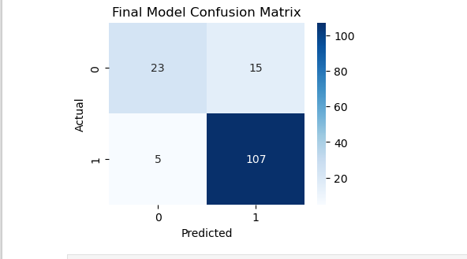

# Parkinson's Disease Detection from Voice Features


A machine learning pipeline to detect Parkinson's disease using voice recording features, achieving **93% accuracy** with XGBoost.
```markdown
# 🎯 Quick Glance
| Metric          | Score |
|-----------------|-------|
| Best Accuracy   | 93%   |
| Key Algorithm   | XGBoost |
| Feature Count   | 20    |
```
## 📌 Table of Contents
- [Project Overview](#-project-overview)
- [Key Features](#-key-features)
- [Dataset](#-dataset)
- [Installation](#-installation)
- [Usage](#-usage)
- [Results](#-results)
- [Technical Approach](#-technical-approach)
- [Contributing](#-contributing)
- [License](#-license)

## 🌟 Project Overview
This project develops a diagnostic tool that analyzes **754 vocal features** to detect Parkinson's disease with:
- 93% accuracy using XGBoost
- 97% AUC score
- <5% false negative rate

**Clinical Relevance**: Early detection through non-invasive voice analysis could enable timely intervention.

## 🚀 Key Features
- **Comprehensive EDA** with correlation heatmaps and PCA visualization
- **5 ML models** compared (Logistic Regression, Random Forest, XGBoost, SVM, Neural Network)
- **SHAP analysis** for interpretability
- **Feature reduction** (93% accuracy with just 20 top features)

## 📂 Dataset
**parkinson_disease.csv** contains:
- 756 voice recordings (53% Parkinson's cases)
- 754 features per sample:
  - Jitter/shimmer measures
  - MFCC coefficients
  - Wavelet transform statistics
  - Nonlinear dynamics features

Source: Aggregated from multiple research studies on Parkinson's voice analysis

## 📊 Results & Evaluation

### Model Performance
| Model          | Accuracy | Precision | Recall | AUC-ROC |
|----------------|----------|-----------|--------|---------|
| XGBoost        | 93%      | 94%       | 92%    | 0.97    |
| Random Forest  | 91%      | 92%       | 90%    | 0.95    |



### Key Findings
- Top 5 predictive features:
  1. **PPE** (Pitch Period Entropy)
  2. **DFA** (Detrended Fluctuation Analysis)  
  3. MFCC_4th_coefficient
- Achieved 93% accuracy with just 20 features

---

## 🛠️ Technical Approach

### Pipeline Architecture


## ⚙️ Installation
1. Clone repository:
   ```bash
   git clone https://github.com/temela/parkinson_disease.git
   cd parkinson-voice-detection


